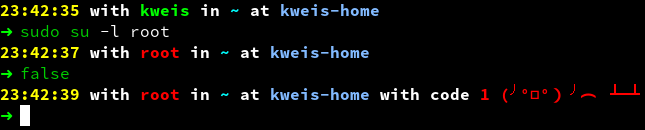

# My Dotfiles

Have a look around and feel free to copy the stuff you like 😊

This dotfiles does not download anything during install, update or usage, besides `git clone` and `git fetch / pull` to the git repo.

# Project Links

- [Git Repo (primary)](https://git.compilenix.org/CompileNix/dotfiles)
- [Git Repo (mirror - github.com)](https://github.com/CompileNix/dotfiles)
- [Git Repo (mirror - gitlab.com)](https://gitlab.com/CompileNix/dotfiles)
- [Issues](https://git.compilenix.org/CompileNix/dotfiles/-/issues)
- [Merge Requests / Pull Requests](https://git.compilenix.org/CompileNix/dotfiles/-/merge_requests)

# Install

**Keep always an existing terminal open, just in case**

<details>
<summary>Debian / Ubuntu</summary>

## Debian / Ubuntu

```bash
# How to get rid of purple background color in newt apps? -> https://askubuntu.com/q/750237
ln -sf /etc/newt/palette.original /etc/alternatives/newt-palette
```

### Required Packages

```bash
apt install \
  bash \
  coreutils \
  curl \
  git \
  lsb-release \
  python3 \
  python3-yaml \
  zsh \
  zsh-autosuggestions \
  zsh-syntax-highlighting \
  zstd
```

### Optional Packages

```bash
apt install \
  acl \
  bind9utils \
  brotli \
  gzip \
  htop \
  iftop \
  iotop \
  jq \
  logrotate \
  mlocate \
  ncdu \
  neovim \
  net-tools \
  rsync \
  sqlite \
  sudo \
  systemd-coredump \
  tmux \
  unzip \
  wget \
  zip
```

**Install**

```bash
curl https://git.compilenix.org/CompileNix/dotfiles/-/raw/main/install.sh --output /tmp/install.sh \
  && /bin/bash /tmp/install.sh \
  && rm -f /tmp/install.sh
```

</details>

<details>
<summary>Fedora</summary>

## Fedora

### Required Packages

```bash
dnf install \
  coreutils \
  curl \
  git \
  python3 \
  python3-pyyaml \
  redhat-lsb-core \
  which \
  zsh \
  zsh-autosuggestions \
  zsh-syntax-highlighting \
  zstd
```

### Optional Packages

```bash
dnf install \
  NetworkManager-tui \
  acl \
  bind-utils \
  dua-cli \
  findutils \
  htop \
  iftop \
  iotop \
  iptables \
  jq \
  logrotate \
  lsd \
  ncdu \
  neovim \
  plocate \
  python3-rich \
  rsync \
  sqlite \
  sudo \
  tmux \
  util-linux-user \
  wget
```

### Fonts

Replace the default emoji font with one that offers some more colors: Google Noto

```bash
dnf remove gdouros-symbola-fonts
dnf install google-noto-emoji-color-fonts
```

**Install**

```bash
curl https://git.compilenix.org/CompileNix/dotfiles/-/raw/main/install.sh --output /tmp/install.sh \
  && /bin/bash /tmp/install.sh \
  && rm -f /tmp/install.sh
```

</details>

<details>
<summary>MacOS</summary>

## MacOS

```bash
# Install Brew
/bin/bash -c "$(curl -fsSL https://raw.githubusercontent.com/Homebrew/install/HEAD/install.sh)"

# Install software & tools
brew install \
  acl2 \
  brotli \
  coreutils \
  curl \
  git \
  gzip \
  htop \
  iftop \
  lsd \
  ncdu \
  neovim \
  net-tools \
  python3 \
  rsync \
  sqlite \
  tmux \
  unzip \
  vim \
  wget \
  zip \
  zsh \
  zsh-autosuggestions \
  zsh-syntax-highlighting \
  zstd

# Install python modules required to install dotfiles
pip3 install rich pyyaml neovim

wget https://git.compilenix.org/CompileNix/dotfiles/-/raw/main/install.sh \
  && chmod +x install.sh \
  && ./install.sh \
  && rm -f install.sh
```

</details>

# Table Of Contents

[TOC]

# ZSH Prompt

I have two options for the zsh prompt built-in: [spaceship-prompt](https://github.com/spaceship-prompt/spaceship-prompt) and my own.

If you'd like to use spaceship-prompt open up `~/.zshrc.env`, set `ENABLE_ZSH_SPACESHIP_PROMPT=true` and start a new shell. From here you can use and configure spaceship-prompt as usual.

My own zsh prompt is visually very similar to spaceship-prompt, with the key difference that no zsh functions or other scripts are invoked between prompt renders. This makes new prompts appear instantly. Only the most basic and fast to render things are included; time, date, username, path, hostname and exit code. Here are the available options with some suggested values, which you can tweak in `~/.zshrc.env`:

```bash
ZSH_PROMPT_EXIT_CODE_COLOR_FAILURE='red'
ZSH_PROMPT_EXIT_CODE_PREFIX='with code'
ZSH_PROMPT_EXIT_CODE_SUFFIX=' (╯°□°）╯︵ ┻━┻'
ZSH_PROMPT_SEPARATE_LINE=true
```

Here is an example, how this looks like:



# Add Your Local Changes

Some configs do support including your (local) changes and overrides, such that they less likely clash with dotfiles updates. Here are the supported tools and configs and how to add your own changes for them:

| Config       | Notes                                                                                                                     |
| :----------- | :------------------------------------------------------------------------------------------------------------------------ |
| `.gitconfig` | `~/.gitconfig_include`                                                                                                    |
| `.tmux.conf` | `~/.tmux.conf_include`. This get's included at the end of `.tmux.conf`                                                    |
| `.vimrc`     | `~/.vimrc_include`                                                                                                        |
| `.zlogout`   | `~/.zlogout_include`. A place for logout tasks & actions                                                                  |
| `.zshrc`     | `~/.zshrc_include`. This get's included after all aliases and functions are defined and before the shell prompt is set-up |

# Automatic Updates

This dotfiles repo does async background update checks, by default, using `git fetch` every time a new shell is started. You'll find the code for this in [home/.zshrc](./home/.zshrc), the zsh function named `test-dotfiles-updates` is called in the background during shell startup and if there is an update in the git repo it will create the temporary file `/tmp/$USER-zsh-dotfiles-async-update-exists.yep`.

When the update check did find some updates in the git repo, it'll show you the git log and ask you if you'd like to pull / merge these changes.

## Disable Automatic Update Checks Permanently

If you'd like to fully disable this, set `ENABLE_ZSH_ASYNC_UPDATE_CHECK=false` in `~/.zshrc.env`.

## Disable Automatic Update Checks temporarily

Use the zsh alias `disable-dotfiles-update-prompt-temp` to disable checking for updates, until either the next reboot or removal of the file `/tmp/$USER-zsh-dotfiles-async-update-check.disabled`.

# ZSH Functions And Aliases

I've added a lot of aliases and functions over the time. To list the functions and aliases, from this repo run `get-functions-dotfiles` and `get-aliases-dotfiles`.

Most of my aliases and zsh functions are named in a similar structure as Powershell recommends; `verb-noun`.

Additionally, all zsh functions from this repo will always show a description of the function on missing arguments or when given `--help` and `-h`.

# Tools

| Name                                                            | Description                                                                                                          | Additional Tags                                                                                |
| :-------------------------------------------------------------- | :------------------------------------------------------------------------------------------------------------------- | :--------------------------------------------------------------------------------------------- |
| [powerline-fonts](https://github.com/powerline/fonts)           | Patched fonts for [Powerline](https://github.com/powerline/powerline) users                                          | cli, font, statusline, vim, neovim, python, zsh, bash, fish, tmux, IPython, Awesome, i3, Qtile |
| [httpstat](https://github.com/reorx/httpstat)                   | httpstat visualizes curl(1) statistics in a way of beauty and clarity.                                               | visualization, python, cli, http, curl                                                         |
| [curlconverter](https://curlconverter.com/)                     | Convert cURL commands to Python, JavaScript, PHP, R, Go, Ruby, Rust, Elixir, Java, MATLAB, C#, Dart and more         | website                                                                                        |
| [jq](https://github.com/stedolan/jq)                            | Command-line JSON processor                                                                                          | cli                                                                                            |
| [ssh-audit](https://github.com/jtesta/ssh-audit)                | SSH server & client auditing (banner, key exchange, encryption, mac, compression, compatibility, security, etc)      | cli, ssh, audit, python, security                                                              |
| [XCA](https://github.com/chris2511/xca)                         | X Certificate and Key management                                                                                     | gui, X509, certificate, management, pkcs7, crl, ec, pkcs11, pkcs12, dsa, pkcs8                 |
| [rich](https://github.com/Textualize/rich)                      | Rich is a Python library for rich text and beautiful formatting in the terminal.                                     | lib                                                                                            |
| [dive](https://github.com/wagoodman/dive)                       | A tool for exploring each layer in a docker image                                                                    | cli, container, image                                                                          |
| [pci](https://github.com/michoo/pci)                            | Packet communication investigator                                                                                    | cli, gui, security, pcap, wireshark, network, analyzer, tshark, graph, python                  |
| [regexr](http://regexr.com/)                                    | RegExr is a HTML/JS based tool for creating, testing, and learning about Regular Expressions.                        | website                                                                                        |
| [Grok Debugger](https://grokdebugger.com/)                      | Debug your Grok patterns                                                                                             | website                                                                                        |
| [Security Headers](https://securityheaders.com)                 | Scan a public websites HTTP security related headers                                                                 | website                                                                                        |
| [Qualys SSL Labs](https://www.ssllabs.com/ssltest/analyze.html) | This free online service performs a deep analysis of the configuration of any SSL web server on the public Internet. | website, X509, certificate                                                                     |
| [TableConvert](https://tableconvert.com/)                       | This converter is used to convert Excel (or other spreadsheets) into Markdown Table.                                 | website                                                                                        |
| [Compiler Explorer](https://godbolt.org/)                       | Run compilers interactively from your web browser and interact with the assembly                                     | website                                                                                        |
| [ctop](https://github.com/bcicen/ctop)                          | Top-like interface for container metrics                                                                             | cli, go, docker, htop                                                                          |
| [tldr++](https://github.com/isacikgoz/tldr)                     | fast and interactive tldr client written with go                                                                     | cli, man-page, help                                                                            |
| [Photopea](https://www.photopea.com)                            | web-based photo and graphics editor supporting Photoshop's PSD as well as JPEG, PNG, DNG, GIF, SVG, PDF and others   | website                                                                                        |

## Rust Tools

| Command              | Crates.io Link                                                    | Description                                                                                   | Additional Tags                        |
| :------------------- | :---------------------------------------------------------------- | :-------------------------------------------------------------------------------------------- | :------------------------------------- |
| `alacritty`          | [alacritty](https://crates.io/crates/alacritty)                   | A fast, cross-platform, OpenGL terminal emulator                                              | rust, gui                              |
| `atuin`              | [atuin](https://crates.io/crates/atuin)                           | magical shell history. A replacement for Arrow+Up and Ctrl+R                                  | rust, cli                              |
| `bat`                | [bat](https://crates.io/crates/bat)                               | Go implement CLI, cURL-like tool for humans                                                   | rust, cli, http                        |
| `cargo-asm`          | [cargo-asm](https://crates.io/crates/cargo-asm)                   | A cargo subcommand that displays the generated assembly of Rust source code.                  | rust, cli                              |
| `cargo-audit`        | [cargo-audit](https://crates.io/crates/cargo-audit)               | Audit Cargo.lock for crates with security vulnerabilities                                     | rust, cli                              |
| `cargo-auditable`    | [cargo-auditable](https://crates.io/crates/cargo-auditable)       | Make production Rust binaries auditable                                                       | rust, cli                              |
| `cargo-bloat`        | [cargo-bloat](https://crates.io/crates/cargo-bloat)               | Find out what takes most of the space in your executable.                                     | rust, cli                              |
| `cargo-cache`        | [cargo-cache](https://crates.io/crates/cargo-cache)               | Manage cargo cache ($CARGO_HOME or \~/.cargo/), show sizes and remove directories selectively | rust, cli                              |
| `cargo-deb`          | [cargo-deb](https://crates.io/crates/cargo-deb)                   | Make Debian packages (.deb) easily with a Cargo subcommand                                    | rust, cli                              |
| `cargo-feature`      | [cargo-feature](https://crates.io/crates/cargo-feature)           | Cargo plugin to manage dependency features                                                    | rust, cli                              |
| `cargo-generate-rpm` | [cargo-generate-rpm](https://crates.io/crates/cargo-generate-rpm) | Generate a binary RPM package (.rpm) from Cargo projects                                      | rust, cli                              |
| `cargo-info`         | [cargo-info](https://crates.io/crates/cargo-info)                 | Extends cargo to query crates.io registry for crates details                                  | rust, cli                              |
| `cargo-nextest`      | [cargo-nextest](https://crates.io/crates/cargo-nextest)           | A next-generation test runner for Rust.                                                       | rust, cli                              |
| `cargo-sort`         | [cargo-sort](https://crates.io/crates/cargo-sort)                 | Check if tables and items in a .toml file are lexically sorted                                | rust, cli                              |
| `cargo-update`       | [cargo-update](https://crates.io/crates/cargo-update)             | A cargo subcommand for checking and applying updates to installed executables                 | rust, cli                              |
| `cargo-watch`        | [cargo-watch](https://crates.io/crates/cargo-watch)               | Watches over your Cargo project's source                                                      | rust, cli                              |
| `eva`                | [eva](https://crates.io/crates/eva)                               | Calculator REPL similar to bc(1)                                                              | rust, cli                              |
| `gpg-tui`            | [gpg-tui](https://crates.io/crates/gpg-tui)                       | Manage your GnuPG keys with ease!                                                             | rust, cli                              |
| `hurl`               | [hurl](https://crates.io/crates/hurl)                             | Hurl, run and test HTTP requests                                                              | rust, cli                              |
| `hyperfine`          | [hyperfine](https://crates.io/crates/hyperfine)                   | A command-line benchmarking tool                                                              | rust, cli                              |
| `lsd`                | [lsd](https://crates.io/crates/lsd)                               | An ls command with a lot of pretty colors and some other stuff.                               | rust, cli                              |
| `oha`                | [oha](https://crates.io/crates/oha)                               | Ohayou(おはよう), HTTP load generator, inspired by rakyll/hey with tui animation.             | rust, cli                              |
| `ripgrep`            | [ripgrep](https://crates.io/crates/ripgrep)                       | Like `grep` but better                                                                        | rust, cli                              |
| `sccache`            | [sccache](https://crates.io/crates/sccache)                       | Sccache is a ccache-like tool.                                                                | rust, cli                              |
| `sd`                 | [sd](https://crates.io/crates/sd)                                 | `sd` is an intuitive find & replace CLI.                                                      | rust, cli, sed                         |
| `starship`           | [starship](https://crates.io/crates/starship)                     | The minimal, blazing-fast, and infinitely customizable prompt for any shell! ☄🌌️             | rust, cli, shell                       |
| `tokei`              | [tokei](https://crates.io/crates/tokei)                           | Count your code, quickly.                                                                     | rust, cli                              |
| `toluol`             | [toluol](https://crates.io/crates/toluol)                         | A crate for making DNS queries                                                                | rust, cli, dig                         |
| `trippy`             | [trippy](https://crates.io/crates/trippy)                         | A network diagnostic tool                                                                     | rust, cli, tcp, udp, icmp, ping, probe |
| `zellij`             | [zellij](https://crates.io/crates/zellij)                         | A terminal workspace with batteries included                                                  | rust, cli, tmux                        |

# VIM / NeoVIM

## Keybinds

Most of them are just the default binds and this just serves as a reminder for the ones I find useful to know and want to remember better.

| Mode: Keybind              | Description                               | Notes                                                                                                                                                                                                                                                       |
| :------------------------- | ----------------------------------------- | :---------------------------------------------------------------------------------------------------------------------------------------------------------------------------------------------------------------------------------------------------------- |
| N: ciw                     | Replace word                              | Delete word under cursor and change to insert mode                                                                                                                                                                                                          |
| N: ci"                     | Replace text inside "                     | Delete text under cursor within the nearest occurrences of "                                                                                                                                                                                                |
| N: Vap                     | Select current block of text              |                                                                                                                                                                                                                                                             |
| N: ctrl+v 2j shift+I # ESC | Block comment                             | `ctrl+v` : change to "Visual Block" mode<br>`2j` : move cursor two lines down<br>`shift+I` : change to "Insert" mode<br>`# ` : line comment text, you want to insert<br>`ESC` : exit "Insert" / "Visual Block" mode and apply changes to all selected lines |
| V: gq                      | Wrap text according to `textwidth`        | [Format lines with 'gq' in Vim](https://www.programmerhat.com/vim-gq/)                                                                                                                                                                                      |
| V: =                       | Apply text format according to `filetype` | Correct alignment of code                                                                                                                                                                                                                                   |

## File Options

Some options I often use in modelines.

| Option                 | Description                                     |
| :--------------------- | :---------------------------------------------- |
| `:set tabstop=4`       | Indent using 4 tabstops                         |
| `:set expandtab`       | Use spaces for indentation, instead of tabstops |
| `:set [no]autoindent`  | Disable / Enable autoindenting                  |
| `:set [no]smartindent` | Disable / Enable smartindenting                 |
| `:set filetype=python` | Override default filetype detection             |

# Additional Plugins Setup for NeoVIM Setup

## Install vim-plug

```bash
sh -c 'curl -fLo "${XDG_DATA_HOME:-$HOME/.local/share}"/nvim/site/autoload/plug.vim --create-dirs https://raw.githubusercontent.com/junegunn/vim-plug/master/plug.vim'
```

## Install Dependencies

NodeJS is required for [coc.nvim](https://github.com/neoclide/coc.nvim/).

```bash
dnf install nodejs
```

## Update `~/.vimrc_include`

<details>
<summary>contents</summary>

```vim
call plug#begin('~/.vim/plugged')

Plug 'neoclide/coc.nvim', {'branch': 'release'}
Plug 'dense-analysis/ale'
Plug 'tpope/vim-surround'
Plug 'ctrlpvim/ctrlp.vim'

call plug#end()


set signcolumn=yes

" Having longer updatetime (default is 4000 ms = 4s) leads to noticeable
" delays and poor user experience
set updatetime=300

" Use tab for trigger completion with characters ahead and navigate
" NOTE: There's always complete item selected by default, you may want to enable
" no select by `"suggest.noselect": true` in your configuration file
" NOTE: Use command ':verbose imap <tab>' to make sure tab is not mapped by
" other plugin before putting this into your config
"inoremap <silent><expr> <TAB>
"            \ coc#pum#visible() ? coc#pum#next(1) :
"            \ CheckBackspace() ? "\<Tab>" :
"            \ coc#refresh()
"inoremap <expr><S-TAB> coc#pum#visible() ? coc#pum#prev(1) : "\<C-h>"

" Make <CR> to accept selected completion item or notify coc.nvim to format
" <C-g>u breaks current undo, please make your own choice
"inoremap <silent><expr> <CR> coc#pum#visible() ? coc#pum#confirm()
"                              \: "\<C-g>u\<CR>\<c-r>=coc#on_enter()\<CR>"
inoremap <silent><expr> <TAB>
            \ coc#pum#visible() ? coc#pum#confirm() : "\<Tab>"

function! CheckBackspace() abort
  let col = col('.') - 1
  return !col || getline('.')[col - 1]  =~# '\s'
endfunction

" Use <c-space> to trigger completion
if has('nvim')
  inoremap <silent><expr> <c-space> coc#refresh()
else
  inoremap <silent><expr> <c-@> coc#refresh()
endif

nmap <silent> gd <Plug>(coc-definition)
nmap <silent> gy <Plug>(coc-type-definition)
nmap <silent> gi <Plug>(coc-implementation)
nmap <silent> gr <Plug>(coc-references)

" Highlight the symbol and its references when holding the cursor
autocmd CursorHold * silent call CocActionAsync('highlight')

" Symbol renaming
nmap <leader>rn <Plug>(coc-rename)

" Use K to show documentation in preview window.
nnoremap <silent> K :call <SID>show_documentation()<CR>

function! s:show_documentation()
  if (index(['vim','help'], &filetype) >= 0)
    execute 'h '.expand('<cword>')
  else
    call CocAction('doHover')
  endif
endfunction

" Remap <PageDown> and <PageUp> to scroll float windows/popups
if has('nvim-0.4.0') || has('patch-8.2.0750')
  nnoremap <silent><nowait><expr> <PageDown> coc#float#has_scroll() ? coc#float#scroll(1) : "\<PageDown>"
  nnoremap <silent><nowait><expr> <PageUp> coc#float#has_scroll() ? coc#float#scroll(0) : "\<PageUp>"
  inoremap <silent><nowait><expr> <PageDown> coc#float#has_scroll() ? "\<c-r>=coc#float#scroll(1)\<cr>" : "\<Right>"
  inoremap <silent><nowait><expr> <PageUp> coc#float#has_scroll() ? "\<c-r>=coc#float#scroll(0)\<cr>" : "\<Left>"
  vnoremap <silent><nowait><expr> <PageDown> coc#float#has_scroll() ? coc#float#scroll(1) : "\<PageDown>"
  vnoremap <silent><nowait><expr> <PageUp> coc#float#has_scroll() ? coc#float#scroll(0) : "\<PageUp>"
endif
```

</details>

Save the config and install the plugins, using the commands inside vim

```
:PlugInstall
```

## Plugins

## CoC JSON

Install in Vim

```
:CocInstall coc-json
```

## Rust Language Server Plugin (LSP)

```
:CocInstall coc-rust-analyzer
:CocConfig
```

JSON snippet to add

```json
{
  "rust-analyzer.check.overrideCommand": [
    "cargo",
    "clippy",
    "--message-format=json",
    "--all-targets",
    "--all-features",
    "--",
    "-Wclippy::pedantic",
    "-Wclippy::cognitive_complexity",
    "-Wclippy::indexing_slicing",
    "-Wclippy::large_include_file",
    "-Wclippy::linkedlist",
    "-Wclippy::map_unwrap_or",
    "-Wclippy::option_option",
    "-Wclippy::verbose_bit_mask",
    "-Wclippy::unused_self",
    "-Wclippy::unreadable_literal",
    "-Wclippy::unnested_or_patterns",
    "-Wclippy::unnecessary_wraps",
    "-Wclippy::uninlined_format_args",
    "-Wclippy::unchecked_duration_subtraction",
    "-Wclippy::too_many_lines",
    "-Wclippy::unwrap_used"
  ],
  "inlayHint.enable": false
}
```

### Update `~/.vimrc_include`

<details>
<summary>contents</summary>

```vim
call plug#begin('~/.vim/plugged')

Plug 'rust-lang/rust.vim'

call plug#end()

let g:rustfmt_autosave = 1
let g:rustfmt_fail_silently = 0
```

</details>

## Bash LSP

Install in Vim

```
:CocInstall coc-sh
```

## Dockerfile LSP

Install LSP in shell

```bash
npm install dockerfile-language-server-nodejs
```

Configure CoC

```
:CocConfig
```

JSON snippet to add

```json
"languageserver": {
  "dockerfile": {
    "command": "docker-langserver",
    "filetypes": ["dockerfile"],
    "args": ["--stdio"]
  }
}
```

## JavaScript / TypeScript LSP

Install LSP in VIM

```
:CocInstall coc-tsserver
```

## Markdown LSP

Install LSP in VIM

```
:CocInstall coc-markdownlint
```

## Markdown Composer

[vim-markdown-composer](https://github.com/euclio/vim-markdown-composer)
An asynchronous markdown preview plugin for Vim and Neovim.

### Update `~/.vimrc_include`

<details>
<summary>contents</summary>

```vim
function! BuildComposer(info)
  if a:info.status != 'unchanged' || a:info.force
    if has('nvim')
      !cargo build --release --locked
    else
      !cargo build --release --locked --no-default-features --features json-rpc
    endif
  endif
endfunction

call plug#begin('~/.vim/plugged')

Plug 'euclio/vim-markdown-composer', { 'do': function('BuildComposer') }

call plug#end()

let g:markdown_composer_autostart = 0
```

</details>

Because the markdown composer does not autostart, here is the vim command for it:

```
:ComposerStart
```

## PHP LSP

Install LSP in shell

```bash
npm install intelephense
```

Configure CoC

```
:CocConfig
```

JSON snippet to add

```json
"languageserver": {
  "intelephense": {
    "command": "intelephense",
    "args": ["--stdio"],
    "filetypes": ["php"],
    "initializationOptions": {
      "storagePath": "/tmp/intelephense"
    }
  }
}
```

## Python LSP

Configure CoC

```
:CocInstall coc-pyright
```

## Comment in and out

### Update `~/.vimrc_include`

<details>
<summary>contents</summary>

```vim
call plug#begin('~/.vim/plugged')

Plug 'gennaro-tedesco/nvim-commaround'

call plug#end()

vmap <leader>c <Plug>ToggleCommaround
```

</details>

## Treesitter

### Update `~/.vimrc_include`

<details>
<summary>contents</summary>

```vim
call plug#begin('~/.vim/plugged')

Plug 'nvim-treesitter/nvim-treesitter'
Plug 'nvim-treesitter/nvim-treesitter-context'

call plug#end()

highlight TreesitterContext ctermfg=White ctermbg=DarkGrey
lua <<EOF
require'treesitter-context'.setup{
  enable = true, -- Enable this plugin (Can be enabled/disabled later via commands)
}
EOF
```

</details>

Install language parsers

```
:TSInstall bash c cpp diff dockerfile git_config gitattributes gitcommit gitignore go gomod gosum html http ini javascript jq jsdoc json json5 jsonc latex lua make markdown markdown_inline passwd perl php python regex rust scheme sc
ss sql toml typescript vue yaml
```

# SwayWM

- ImageMagick (for screen lock image processing)
- dmenu
- dunst
- gimp
- gnome-terminal
- grimshot
- imv
- jtc
- kanshi
- light
- mako
- mako (notifications)
- rofi
- slurp (for screenshots)
- sway
- swayidle (turn off & on displays)
- swaylock
- thunar (filemanager)
- waybar
- wf-recorder (cli screen recorder, obs doesn't work)
- wl-clipboard

# X11 .xinitrc

- i3
- xrdb
- xinput
- xset
- setxkbmap
- xsetroot
- numlockx
- autocutsel
  - https://github.com/sigmike/autocutsel
  - `dnf install libX11-devel libXaw-devel`
- dbus-launch
- ImageMagick (for screen lock image processing)
- dmenu
- rofi
- lxterminal
- gimp
- thunar (filemanager)

# Update

Use the zsh function `update-dotfiles`.

If you have a really old version, you may need to update it manually.

## Manual Update

Copy and paste into terminal, after that start a new (separat) terminal / session to verify everything worked out fine.

**Keep always a additional terminal open, in case of any issues!**

```bash
rm -rf ~/dotfiles 2>/dev/null
wget https://git.compilenix.org/CompileNix/dotfiles/-/raw/main/install.sh \
  && chmod +x install.sh \
  && ./install.sh \
  && rm -f install.sh
exit
zsh
```

## Update Spaceship Prompt Plugin

```bash
cd ~/dotfiles
temp_dir="/tmp/$(uuidgen)"
mkdir -pv "$temp_dir"
cd "$temp_dir"
git clone https://github.com/spaceship-prompt/spaceship-prompt.git git_repo
cd git_repo
echo "Which tag or commit to checkout? "; read checkout_target
git checkout "$checkout_target"
commit_id=$(git rev-parse HEAD)
echo "commit id: $commit_id"
rm -rf .git tests .github docs
tar --create --file "../${commit_id}.tar.zstd" --preserve-permissions --zstd .
cp -v "../${commit_id}.tar.zstd" ~/dotfiles/zsh-plugins/spaceship-prompt/
popd >/dev/null
popd >/dev/null
unset checkout_target
unset commit_id
rm -rf "$temp_dir"
```

# Test / Build / Dev

- Comment out "git clone" in install.sh
- Comment out "git reset --hard" in home/.zshrc
- Comment out "git pull" in home/.zshrc

```bash
cd test
docker build -t local/dotfiles:ubuntu -f ubuntu.Dockerfile .
cd ..
docker run -it --rm -v $(pwd)/:/root/dotfiles:z local/dotfiles:ubuntu
# Run bash ./dotfiles/install.sh
# Run zsh

cd test
docker build -t local/dotfiles:fedora -f fedora.Dockerfile .
cd ..
docker run -it --rm -v $(pwd)/:/root/dotfiles:z local/dotfiles:fedora
# Run bash ./dotfiles/install.sh
# Run zsh
```

# Sway Desktop Notifications (Wayland)

Install:

- mako
- [notify-send.py](https://github.com/phuhl/notify-send.py) via `pip install notify-send.py --user`
- amixer

# i3 Desktop Notifications (X11)

Install:

- [deadd-notification-center](https://github.com/phuhl/linux_notification_center)
- [notify-send.py](https://github.com/phuhl/notify-send.py) via `pip install notify-send.py --user`
- amixer

# GNOME Settings

```bash
# switch the input focus on mouse hover, without clicking, like in i3 and SwayWM
gsettings set org.gnome.desktop.wm.preferences focus-mode 'mouse' # this also unfocuses a window when mouse moves out (i.e. to desktop bg)
gsettings set org.gnome.desktop.wm.preferences focus-new-windows 'strict' # don't focus new windows (that aren't under the mouse)
gsettings set org.gnome.mutter focus-change-on-pointer-rest false # don't wait for the mouse to stay still until focus

# Disable "hot corner"
gsettings set org.gnome.desktop.interface enable-hot-corners false

# keyboard settings
gsettings set org.gnome.desktop.peripherals.keyboard delay 150
gsettings set org.gnome.desktop.peripherals.keyboard repeat-interval 28

# mouse accel profile
gsettings set org.gnome.desktop.peripherals.mouse accel-profile 'flat'

# my personal mouse speed
gsettings set org.gnome.desktop.peripherals.mouse speed 0

# Whether to resize windows with the right button
gsettings set org.gnome.desktop.wm.preferences resize-with-right-button true

# disable bells
gsettings set org.gnome.desktop.wm.preferences audible-bell false
gsettings set org.gnome.desktop.wm.preferences visual-bell false

# disable desktop workspaces
gsettings set org.gnome.desktop.wm.preferences num-workspaces 1

# Disable Desktop Animations
gsettings set org.gnome.desktop.interface enable-animations false

# disable automatic update
gsettings set org.gnome.software download-updates false
gsettings set org.gnome.software download-updates-notify false

# Files App
# disable recursive search
gsettings set org.gnome.nautilus.preferences recursive-search 'never'
# don't count files of dirs
gsettings set org.gnome.nautilus.preferences show-directory-item-counts 'never'

# switch between windows in current workspace only
gsettings set org.gnome.shell.window-switcher current-workspace-only true

# Alt+Tab behavior
# The default is to have `Alt-Tab` switch you between applications in the current workspace. One can use `Alt-backtick` (or whatever key you have above Tab) to switch between windows in the current application.
# I prefer a Windows-like setup, where `Alt-Tab` switches between windows in the current workspace, regardless of the application to which they belong.
gsettings set org.gnome.desktop.wm.keybindings switch-applications "[]"
gsettings set org.gnome.desktop.wm.keybindings switch-applications-backward "[]"
gsettings set org.gnome.desktop.wm.keybindings switch-windows "['<Alt>Tab', '<Super>Tab']"
gsettings set org.gnome.desktop.wm.keybindings switch-windows-backward  "['<Alt><Shift>Tab', '<Super><Shift>Tab']"

# custom keybinding to start new terminal with Super+Enter
gsettings set org.gnome.settings-daemon.plugins.media-keys custom-keybindings "['/org/gnome/settings-daemon/plugins/media-keys/custom-keybindings/custom0/']"
gsettings set org.gnome.settings-daemon.plugins.media-keys.custom-keybinding:/org/gnome/settings-daemon/plugins/media-keys/custom-keybindings/custom0/ name 'Start Terminal'
gsettings set org.gnome.settings-daemon.plugins.media-keys.custom-keybinding:/org/gnome/settings-daemon/plugins/media-keys/custom-keybindings/custom0/ binding '<Super>Return'
# gnome-terminal
gsettings set org.gnome.settings-daemon.plugins.media-keys.custom-keybinding:/org/gnome/settings-daemon/plugins/media-keys/custom-keybindings/custom0/ command 'gnome-terminal'
# alacritty (via cargo install alacritty)
# gsettings set org.gnome.settings-daemon.plugins.media-keys.custom-keybinding:/org/gnome/settings-daemon/plugins/media-keys/custom-keybindings/custom0/ command '/home/kweis/.cargo/bin/alacritty'

# Characters And Emoji Application
gsettings set org.gnome.settings-daemon.plugins.media-keys custom-keybindings "['/org/gnome/settings-daemon/plugins/media-keys/custom-keybindings/custom1/']"
gsettings set org.gnome.settings-daemon.plugins.media-keys.custom-keybinding:/org/gnome/settings-daemon/plugins/media-keys/custom-keybindings/custom1/ name 'Characters And Emoji Application'
gsettings set org.gnome.settings-daemon.plugins.media-keys.custom-keybinding:/org/gnome/settings-daemon/plugins/media-keys/custom-keybindings/custom1/ binding '<Super>period'
gsettings set org.gnome.settings-daemon.plugins.media-keys.custom-keybinding:/org/gnome/settings-daemon/plugins/media-keys/custom-keybindings/custom1/ command '/usr/bin/gjs-console /usr/bin/gnome-characters'

# custom keybinding start start files app in home dir with Super+E
gsettings set org.gnome.settings-daemon.plugins.media-keys home "['<Super>e']"

# Font things
gsettings set org.gnome.desktop.interface monospace-font-name 'Source Code Pro 10'
gsettings set org.gnome.gedit.preferences.editor editor-font 'Fira Code 11'
gsettings set org.gnome.TextEditor custom-font 'Fira Code 11'
gsettings set org.gnome.desktop.interface font-hinting 'full'
gsettings set org.gnome.desktop.interface font-antialiasing 'grayscale'

# automatically remove old files from trash after 30 days
gsettings set org.gnome.desktop.privacy recent-files-max-age 30
gsettings set org.gnome.desktop.privacy remove-old-trash-files true
gsettings set org.gnome.desktop.privacy remove-old-temp-files true
```

## Gnome Extensions

- [Tiling Assistant](https://extensions.gnome.org/extension/3733/tiling-assistant/)
  - Expand GNOME's 2 column tiling and add a Windows-snap-assist-inspired popup
- [Animation Tweaks](https://extensions.gnome.org/extension/1680/animation-tweaks/)
  - Additional Gnome UI effects
- [AppIndicator and KStatusNotifierItem Support](https://extensions.gnome.org/extension/615/appindicator-support/)
  - Tray icon support
- [GSConnect](https://extensions.gnome.org/extension/1319/gsconnect/)
  - A complete implementation of KDE Connect
- [Grand Theft Focus](https://extensions.gnome.org/extension/5410/grand-theft-focus/)
  - Removes the 'Window is ready' notification and brings the window into focus instead.

# UI Settings

Using:

- `lxappearance`
- Default Font: Helvetica LT Pro 11

## Replace text cursor with regular mouse pointer

```bash
cd /usr/share/icons/Adwaita/cursors/
ln -sf left_ptr text
ln -sf left_ptr xterm
```

## GTK Themes

- [Azure](https://github.com/vinceliuice/Azure-theme)
- [Arc-Dark-OSX](https://github.com/Dr-Noob/Arc-Dark-OSX)

## Troubleshooting

### Create links to missing cursors

```bash
cd ~/.icons/theme/cursors/
ln -s right_ptr arrow
ln -s cross crosshair
ln -s right_ptr draft_large
ln -s right_ptr draft_small
ln -s cross plus
ln -s left_ptr top_left_arrow
ln -s cross tcross
ln -s hand hand1
ln -s hand hand2
ln -s left_side left_tee
ln -s left_ptr ul_angle
ln -s left_ptr ur_angle
```

# Windows


## Tools / Software

- [VeraCrypt](https://veracrypt.fr/): Free open source disk encryption software for Windows, Mac OSX and Linux
- [7-ZIP](https://www.7-zip.org/): archive file management
- [Process Explorer](https://docs.microsoft.com/en-us/sysinternals/downloads/process-explorer): more advanced Task Manager
- [TeraCopy](https://www.codesector.com/teracopy): better file copy & move
- [NetLimiter](https://www.netlimiter.com/): alternative firewall (not based on Windows Firewall)

